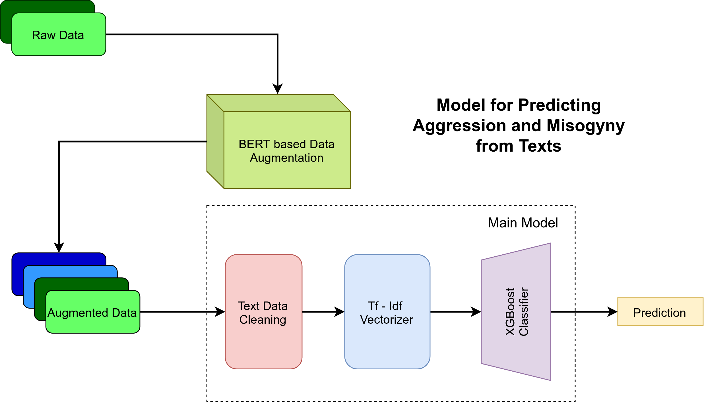
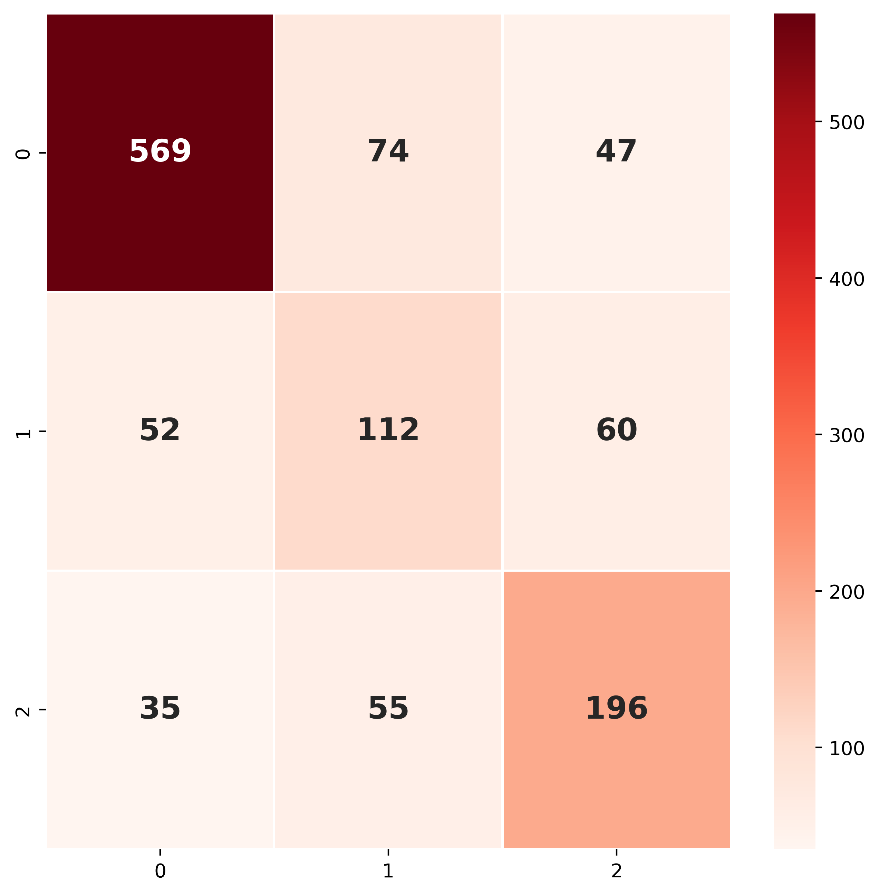
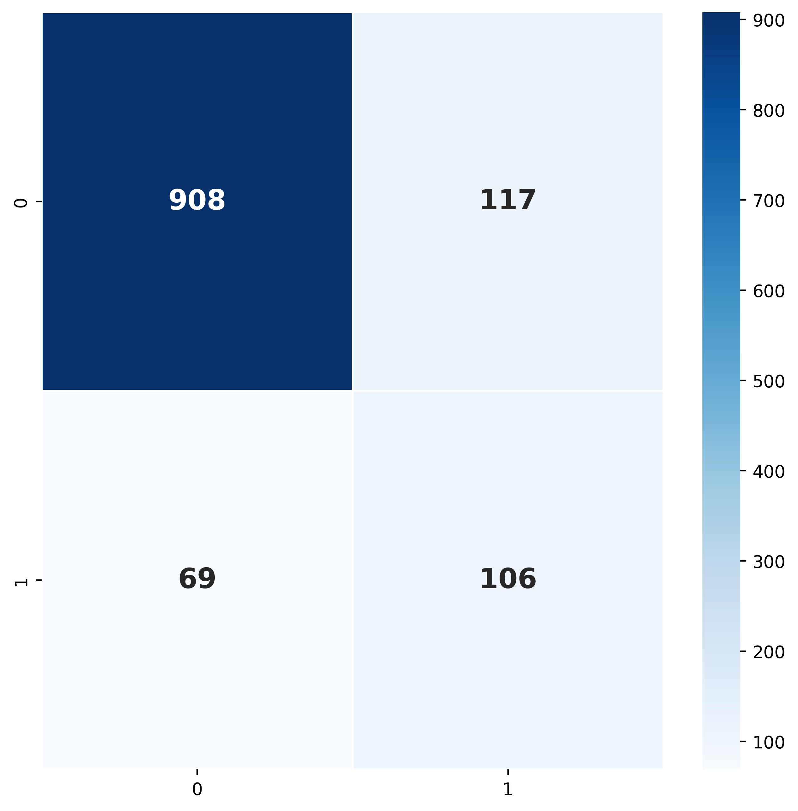

# An Efficient BERT Aided Pipeline to Detect Aggression and Misogyny
<!-- Insert Abstract here -->

## Paper Link

## Model Pipeline

## Training and Inference
* Create a virtual environment. [See here](https://docs.python.org/3/library/venv.html)
* Clone the repository [See here](https://www.atlassian.com/git/tutorials/setting-up-a-repository/git-clone)
* Navigate to the cloned repository
* Install requirements as `pip install -r requirements.txt`
* Navigate to `/core` directory and set it as your _current working directory_
* run `bash ./run.sh` for train, validation and inference

## Results (Weighted F1 Score)
|Team Name(Cited in paper)|Score Sub Task A|Score Sub Task B|
|--|--|--|
|Julian|0.802|0.851|
|abaruah|0.728|0.870|
|sdhanshu|0.759|0.857|
|**Our Model**|**0.735**|**0.852**|

## Analysis
<!-- Insert Analysis, Confusion Matrix -->
